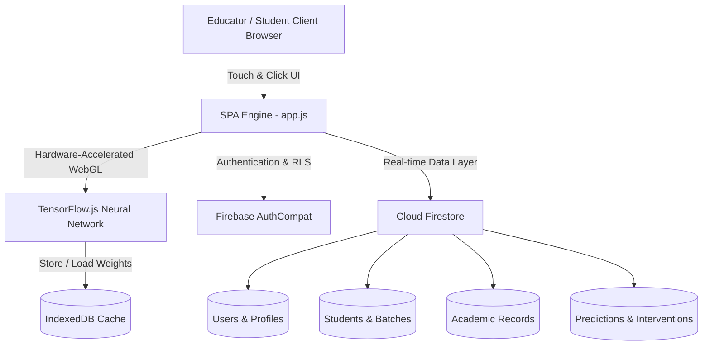

# 🎓 EduPredict AI — Institutional Academic Intelligence & Early Intervention System
### *Tailored for Techno Institute of Higher Studies (TIHS Lucknow) • Affiliated with University of Lucknow (LU) & AKTU*

[](https://js.tensorflow.org/)
[](https://firebase.google.com/)
[](LICENSE)
[](manifest.webmanifest)
[](index.html)

---

## 📌 Executive Summary

**EduPredict AI** is an institutional academic forecasting, early warning, and intervention platform developed for **Techno Institute of Higher Studies (TIHS Lucknow)**. 

Traditional educational institutes discover student performance issues only after semester examinations conclude—when it is too late to intervene. **EduPredict AI** solves this by running an **in-browser TensorFlow.js Deep Neural Network (MLP)** directly on real-time academic indicators (continuous attendance, assignment submissions, internal assessments, and historical score trajectories).

The system empowers educators and HODs to forecast semester outcomes, catch students falling below **Lucknow University's strict 75% attendance threshold**, and launch personalized academic intervention plans *before exams happen*.

---

## 🌟 Key Features

### 1. 🧠 Client-Side TensorFlow.js Deep Learning Engine
- **Dense Multi-Layer Perceptron (MLP)** architecture with hidden Dense(16, ReLU) and Dense(8, ReLU) layers with Sigmoid output.
- **Hardware-Accelerated WebGL Execution**: Real-time neural inference executes in `< 2ms` with zero backend server lag.
- **Client-Side Model Retraining**: Teachers can retrain the neural network on updated semester marks in 35 epochs right in the browser.
- **Automated Memory Safety**: Strict `tf.tidy()` memory disposal eliminates GPU tensor leaks.
- **IndexedDB Model Caching**: Persistent offline model storage via `indexeddb://edupredict-tf-model` with seamless heuristic fallback.

### 2. 🏛️ TIHS Lucknow Institutional Course & Section Architecture
- Seamless switching between institutional departments:
  - **Undergraduate (LU Affiliated)**: BCA, BBA, B.Com, B.Com (Hons), BAJMC, BFA, B.Sc, B.Ed
  - **Postgraduate (AKTU & LU Affiliated)**: M.Com, MBA, MCA
- Filter classes by **1st Year / 2nd Year / 3rd Year** and **Section A / Section B**.
- Built-in compliance monitoring for **Lucknow University's 75% Mandatory Attendance Rule**, highlighting at-risk students who cannot sit for semester exams without medical/administrative condonation.

### 3. 📱 Adaptive Mobile Web App & Desktop UI
- **PC Desktop Experience**: Premium glassmorphism dual portal, collapsable sidebar navigation, multi-column analytics, interactive charts, and dense management grids.
- **Mobile Web App Shell**: Automatic device and mobile browser detection that transforms into a native mobile app feel:
  - Touch-friendly bottom navigation dock with haptic feedback transitions
  - Compact mobile top header with institution banner and quick action drawer
  - Horizontally scrollable batch pills and responsive student table cards
  - Dynamic viewport scaling (`100dvh`) without mobile browser navigation bar jumps.

### 4. 👥 Dual Dedicated Workspaces

| Feature | 👨‍🎓 Student Portal | 👩‍🏫 Educator / HOD Workspace |
| :--- | :--- | :--- |
| **Authentication** | Email or Phone + Password | Email or Phone + Secure Admin Role Approval |
| **Academic Tracking** | Continuous attendance, internal score meters | Class-wide roster, batch section analytics |
| **Prediction Signal** | Transparent read-only risk & score forecast | Live batch prediction, retrainable TF.js model |
| **Early Warning** | Proactive warning notices & study recommendations | Filtered at-risk list, bulk SMS/notification alerts |
| **AI Copilot** | Personalized study advice & revision guide | Student risk explanation & remediation assistant |
| **Reporting & Export**| Downloadable official student PDF report | Bulk Excel/CSV import, class Excel sheet export |

---

## 🏗️ System Architecture



---

## ⚡ Quick Start & Local Development

### Prerequisites
- Modern web browser (Chrome, Edge, Safari, Firefox)
- Python 3.x (or any local static HTTP server)

### 1. Clone Repository
```bash
git clone https://github.com/Ambesh-dev/EduPredict-AI_.git
cd EduPredict-AI_
```

### 2. Run Local Development Server
```bash
# Using Python
python -m http.server 5500

# Or using Node.js npx
npx serve -l 5500
```
Open **`http://localhost:5500`** in your browser.

### 3. Instant Demo Modes (No Firebase Config Required)
For rapid evaluation and hackathon judging, pre-configured demo workflows are accessible directly via query parameters:
- **Teacher / HOD Workspace Demo**: `http://localhost:5500/?demo=teacher`
- **Student Portal Demo**: `http://localhost:5500/?demo=student`

---

## 🔒 Security & Data Privacy

1. **Zero-Cost Phone Authentication**: Implements a client-hashed phone index resolving internal Firebase credentials, avoiding costly SMS carrier fees while maintaining security on the Firebase Spark tier.
2. **Role-Based Access Control (RBAC)**: Enforced via Firestore Security Rules (`firebase.rules`). Teachers start in `teacher_pending` until verified; students cannot access or manipulate teacher prediction collections.
3. **Client-Side Privacy**: Predictions and neural calculations execute directly in the user's browser, preventing external data scraping.

---

## 📊 Course Matrix (TIHS Lucknow)

| Program | Degree | Affiliating Body | Duration | Sections Covered |
| :--- | :--- | :--- | :--- | :--- |
| **BCA** | Bachelor of Computer Applications | University of Lucknow | 3 Years | Sec A, Sec B |
| **BBA** | Bachelor of Business Administration | University of Lucknow | 3 Years | Sec A, Sec B |
| **B.Com** | Bachelor of Commerce | University of Lucknow | 3 Years | Sec A, Sec B |
| **B.Com (Hons)**| Bachelor of Commerce (Honours) | University of Lucknow | 3 Years | Sec A |
| **BAJMC** | Journalism & Mass Communication | University of Lucknow | 3 Years | Sec A |
| **BFA / B.Sc** | Fine Arts & Science Programs | University of Lucknow | 3-4 Years | Sec A |
| **B.Ed** | Bachelor of Education | University of Lucknow | 2 Years | Sec A |
| **MBA / MCA** | Management & Computer Apps | AKTU / LU | 2 Years | Sec A, Sec B |

---

## 🏆 Hackathon Presentation Highlights

When demonstrating EduPredict AI to judges:
1. **Highlight the Client-Side AI**: Emphasize that the neural network runs via TensorFlow.js in the browser (WebGL) without needing expensive GPU servers or cloud API keys.
2. **Showcase the TIHS Lucknow Real-World Alignment**: Switch from BCA Section A to Section B and point out Lucknow University's 75% attendance rule triggering early warnings for students under threshold.
3. **Switch to Mobile Web View**: Open DevTools in device emulation mode or test on a mobile phone to show the responsive native-like web app bottom dock and touch gestures.
4. **Demonstrate Model Retraining**: Click "⚡ Retrain Model" in the AI Prediction tab to demonstrate in-browser transfer learning across 35 epochs in real time.

---

## 📄 License
This project is licensed under the MIT License — see the [LICENSE](LICENSE) file for details.
